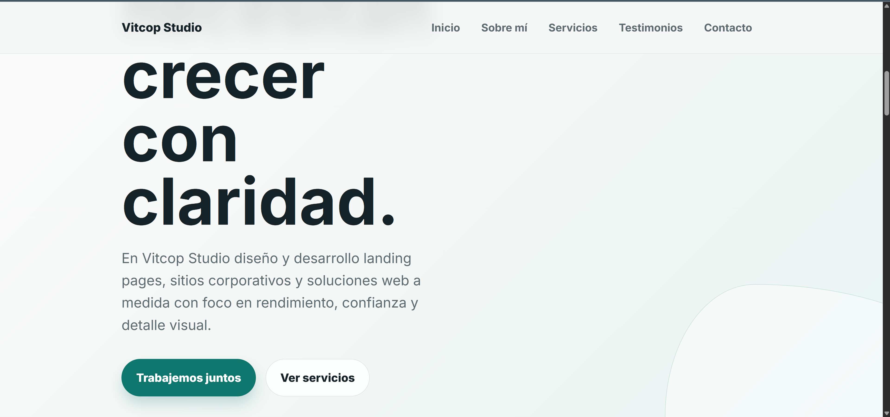
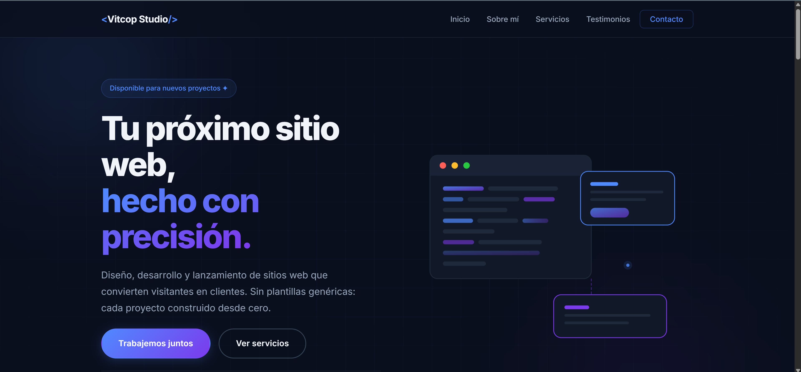

# 🤖 PFO2 — Prompt Engineering en Agentes de IA

Práctica Formativa Obligatoria 2 de la materia **Desarrollo Web** (IFTS N°29).
El trabajo consiste en diseñar **un único prompt de alta precisión** y ejecutarlo
—sin modificar el código manualmente— en **dos agentes de desarrollo de IA**
distintos, para comparar su capacidad de resolución autónoma generando una
landing page de servicios freelance.

---

## 👤 Datos del estudiante

- **Nombre:** Sebastián Vitcop
- **Materia:** Desarrollo Web — IFTS N°29
- **Comisión:** Viernes

---

## 🚀 Deploy unificado

🔗 **Portada (acceso a las 3 opciones):** `https://[COMPLETAR-TU-DEPLOY].vercel.app/`

La portada permite acceder a:
1. El prompt utilizado (texto plano)
2. La landing generada por el Agente 1
3. La landing generada por el Agente 2

---

## 🧰 Agentes utilizados

| # | Agente | Modelo de lenguaje |
|---|--------|--------------------|
| 1 | Codex (OpenAI) | [COMPLETAR, ej. GPT-5-Codex] |
| 2 | Claude Code | [COMPLETAR, ej. Claude Opus 4.5] |

> **Restricción cumplida:** no se modificó el código generado por los agentes de
> forma manual. Cada landing es exactamente la salida autónoma de su agente.
>
> **Sobre los planes utilizados:** el Agente 1 (Codex) se ejecutó con la versión
> gratuita incluida en ChatGPT, y el Agente 2 (Claude Code) con una suscripción
> Claude Pro. Ambos accesos permiten correr el agente de forma autónoma sin costo
> adicional por token.

---

## 📝 Prompt exacto utilizado

El mismo texto se ejecutó, sin cambios, en ambos agentes:

```
# ROL Y CONTEXTO
Actuá como un desarrollador frontend senior especializado en landing pages
de alta conversión. Tu tarea es generar una landing page profesional, completa
y lista para producción que promocione los servicios freelance de desarrollo
web de "Sebastián Vitcop".

# OBJETIVO
Generar UNA única landing page en un archivo `index.html` autocontenido:
HTML5 + todo el CSS dentro de una etiqueta <style> + el JavaScript mínimo
necesario dentro de una etiqueta <script>. Sin dependencias externas, salvo
una fuente de Google Fonts. Debe ser responsiva, accesible y visualmente
atractiva.

# PÚBLICO Y TONO
Público objetivo: pymes, emprendedores y startups que necesitan presencia web.
Tono: profesional, cercano y confiable.
Idioma de todos los textos: español.

# SECCIONES OBLIGATORIAS (respetá este orden exacto)
1. HEADER fijo (sticky) con el nombre/logo "Sebastián Vitcop" y un menú de
   navegación con anclas a: Sobre mí, Servicios, Testimonios, Contacto.
   El menú debe colapsar en un menú hamburguesa funcional en mobile.
2. HERO: título impactante sobre desarrollo web freelance, un subtítulo de una
   línea y un botón CTA destacado con el texto "Trabajemos juntos" que haga
   scroll suave hasta la sección Contacto. Agregá un detalle visual de fondo
   (gradiente sutil o forma geométrica).
3. SOBRE MÍ: un párrafo presentando a Sebastián como estudiante de la
   Tecnicatura en Desarrollo Web (IFTS Nº29), apasionado por construir
   interfaces limpias y soluciones a medida para cada cliente.
4. SERVICIOS: mínimo 3 tarjetas, cada una con un ícono (puede ser un emoji o
   SVG simple), un título y una descripción breve. Por ejemplo: "Landing Pages",
   "Sitios Web Responsivos" y "Optimización y Mantenimiento". Organizá las
   tarjetas con CSS Grid o Flexbox.
5. TESTIMONIOS: mínimo 2 reseñas, cada una con el texto del testimonio, el
   nombre de un cliente ficticio y su rol/empresa.
6. FORMULARIO DE CONTACTO: solo maquetado visual, SIN backend ni funcionalidad
   real de envío. Campos: Nombre, Email y Mensaje, más un botón "Enviar".
   Debe verse profesional y prolijo.
7. FOOTER con enlaces a redes sociales (GitHub, LinkedIn, Email) y una línea
   de copyright.

# REQUISITOS TÉCNICOS
- HTML5 semántico (header, nav, main, section, article, footer) con lang="es".
- Metaetiquetas charset UTF-8 y viewport.
- Una tipografía importada desde Google Fonts.
- Layout construido con Flexbox y/o CSS Grid.
- Diseño totalmente responsivo (mobile, tablet, desktop) usando media queries
  y unidades relativas (%, rem, clamp).
- Al menos una animación o transición CSS (por ejemplo, efecto hover en botones
  y tarjetas).
- Atributo alt en todas las imágenes y buenas prácticas de accesibilidad.
- Una paleta de colores coherente, sobria y profesional.
- Comentarios en el código explicando cada sección.

# FORMATO DE SALIDA
Devolvé únicamente el archivo `index.html` completo, funcional y autocontenido.
No uses librerías ni frameworks externos (nada de Bootstrap, Tailwind, React,
etc.). No agregues explicaciones fuera del código.

# CRITERIOS DE ÉXITO
La página debe poder abrirse directamente en el navegador y verse profesional
sin pasos adicionales. Todas las secciones presentes, diseño responsivo y sin
errores en la consola del navegador.
```

---

## 📸 Capturas de pantalla

### Agente 1 — Codex (OpenAI)


### Agente 2 — Claude Code


---

## 🗂 Estructura del proyecto

```
pfo2-prompt-engineering/
├── index.html              # Portada con los 3 accesos
├── prompt.txt              # El prompt en texto plano
├── README.md               # Este archivo
├── agente-1-codex/
│   └── index.html          # Landing generada por Codex (sin editar)
├── agente-2-claude-code/
│   └── index.html          # Landing generada por Claude Code (sin editar)
└── img/
    ├── captura-codex.png        # Captura del sitio del Agente 1
    └── captura-claude-code.png  # Captura del sitio del Agente 2
```

---

## 🧠 Diseño del prompt — buenas prácticas aplicadas

El prompt se construyó siguiendo las guías oficiales de **Anthropic** y **OpenAI**:

- **Rol y contexto explícitos** al inicio, para orientar el comportamiento del agente.
- **Objetivo claro y único** (un solo archivo autocontenido).
- **Requisitos estructurados y numerados**, sin ambigüedad.
- **Formato de salida especificado** de forma estricta.
- **Restricciones explícitas** (sin frameworks, sin dependencias).
- **Criterios de éxito medibles** al final.
